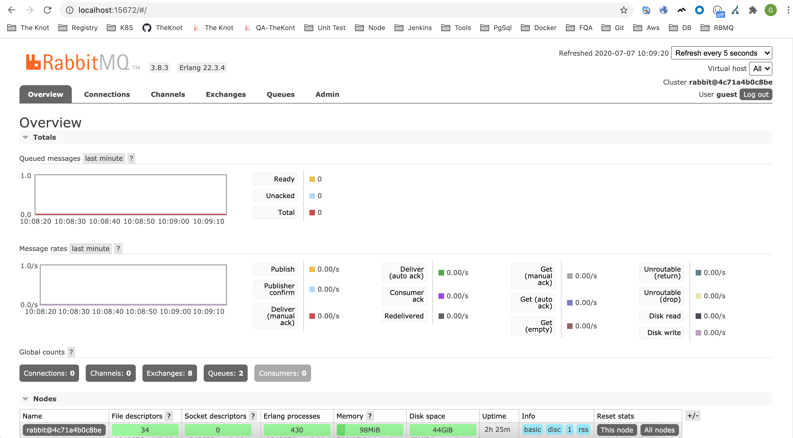
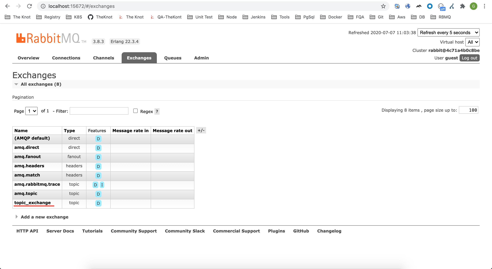
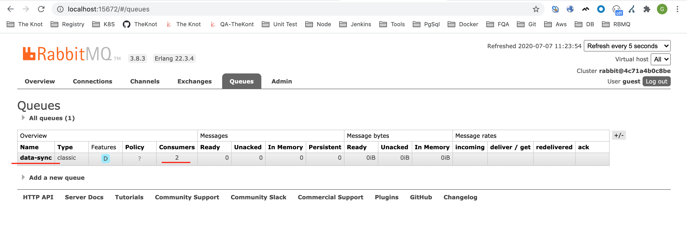
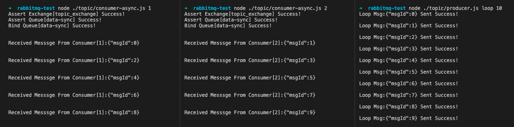
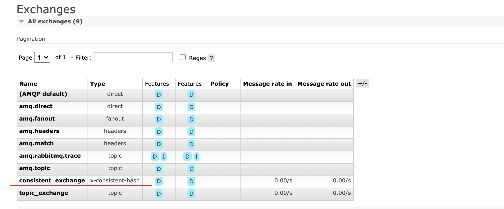
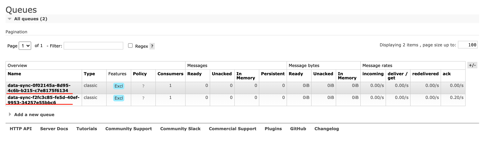
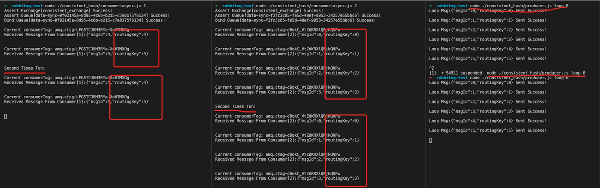

# RabbitMQ Practice

## Background：
* Sometimes we have a strong sequential requirement for requesting operations.
* Ensure that a sequence of requests is executed in sequence.
* Ensure that all requests are executed successfully.
* Messages can be persisted when a service exception occurs.

## The Part Of RabbitMQ

+ **Producer**: _Message producer(The system that sends the request message.)_

+ **Exchange**: _Message exchanger(Receive request messages from the Producer, depending on the type(fanout,direct,topic,headers) of Exchange and its corresponding rules，send messages to one or more specified queues.)_
    - **Fanout** : _The message would be sent to all queues which bound to this exchange._ 
        - 

    - **Direct** : _The message goes to the queues whose `binding key` matches the `routing key(exactly)` of the message._ 
        - 
  
    - **Topic**  : _The message goes to the queues whose `binding key` matches the `routing key(with wildcards)` of the message._
        - 

    - **Headers**: _The headers exchange is designed for routing on multiple attributes that are more easily expressed as message headers than a routing key. Headers exchanges ignore the routing key attribute. Instead, the attributes used for routing are taken from the headers attribute. A message is considered matching if the value of the header equals the value specified upon binding._
 
+ **Queue**   : _The message queue is responsible for storing messages, and the persistent storage can ensure that the messages will not be lost. The message order is FIFO by default._
    * **durable**   : _If `durable` is `true`, the current queue will be persistent(After RabbitMQ restarts, it is guaranteed that the queue still exists)._

    * **exclusive** : _If `exclusive` is `true`, the current queue are only allowed to have one consumer, and when the consumer disconnects, queues are automatically deleted(Whether the queue is empty or not)_

+ **Consumer**: _Receive and process messages in the queue._

+ **Message Acknowledgements**:
    * **automatic acknowledgement model**: _After broker sends a message to an application._

    * **explicit acknowledgement model** : _After the application sends back an acknowledgement._

## Code Example

### The premise: 
_Run RabbitMQ with Docker : `docker run -it --rm --name rabbitmq -p 5672:5672 -p 15672:15672 rabbitmq:3-management`_

_Open `http://localhost:15672/` to use the GUI:_ 
- 


### Use Topic Exchange
#### Consumer :
``` javascript
const amqp = require('amqplib');

const initConsumer = (async () => {
    try {
        const connection = await amqp.connect('amqp://localhost');
        const channel = await connection.createChannel();

        const exchangeName = 'topic_exchange';
        const exchangeType = 'topic';
        const routingPattern = '*.data-sync';
        const queueName = `data-sync`;

        await channel.prefetch(1);

        await channel.assertExchange(exchangeName, exchangeType, { durable: true });
        console.log(`Assert Exchange[${exchangeName}] Success!`);

        await channel.assertQueue(queueName, { exclusive: false, autoDelete: true });
        console.log(`Assert Queue[${queueName}] Success!`);

        await channel.bindQueue(queueName, exchangeName, routingPattern);
        console.log(`Bind Queue[${queueName}] Success!`);
        console.log(' ');
        console.log(' ');

        await channel.consume(queueName, (msg) => {
            setTimeout(async () => {
                if(msg.content) {
                    // console.log(`Current consumerTag: ${msg.fields.consumerTag}`);
                    console.log(`Received Messsge From Consumer[${process.argv[2]}]:${msg.content.toString()}`);
                    console.log(' ');
                    console.log(' ');
                }
                channel.ack(msg);
            }, 1000);
        }, { noAck: false });
    } catch (error) {
        console.error('Catch Some Error:', error);
    }
});

initConsumer();
```

#### Producer :
``` javascript
const amqp = require('amqplib');

const initProducer = (async () => {
    const connection = await amqp.connect('amqp://localhost');
    const channel = await connection.createChannel();

    const exchangeName = 'topic_exchange';
    const exchangeType = 'topic';

    await channel.assertExchange(exchangeName, exchangeType, { durable: true });
    console.log(`Assert Exchange[${exchangeName}] Success!`);

    if(process.argv[2] == 'loop') {
        const loopTimes = Number(process.argv[3]);
        for (let i = 0; i < loopTimes; i++) {
            const routingKey = `${i}.data-sync`;
            const msg = {
                msgId: i
            };
            channel.publish(exchangeName, routingKey, Buffer.from(JSON.stringify(msg)));    
            
            console.log(`Loop Msg:${JSON.stringify(msg)} Sent Success!`);
            console.log(' ');
        }
    } else {
        const routingKey = `${process.argv[2]}.data-sync`;
        const msg = {
            msgId: process.argv[2]
        };
        channel.publish(exchangeName, routingKey, Buffer.from(JSON.stringify(msg)));
        console.log(`Single Msg:${JSON.stringify(msg)} Sent Success!`);
        console.log(' ');
    }
})

initProducer();
```

#### Run :
+ **First run 2 Consumer(consumer1,consumer2)**:

    * After run `node ./topic/consumer-async.js 1` and `node ./topic/consumer-async.js 2`.
    * The Exchange named `topic_exchange` assert success.
    * The Queue named `data-sync` assert success and it has 2 Consumers.

- 

- 

+ **Than run 1 Producer**:

    * After run `node ./topic/producer-async.js loop 10`, the producer will publish 10 msg to `data-sync` Queue.
    * And the 2 `Consumer` will process the `msg` evenly.

- 

### Use Consistent-Hash Exchange
#### Add Plugin : 
- Go inside the container : `docker exec -it ${container-id} /bin/bash`
- Add plugin : `rabbitmq-plugins enable rabbitmq_consistent_hash_exchange`
#### Consumer :
``` javascript
const amqp = require('amqplib');
const uuid = require('node-uuid');

const initConsumer = (async () => {
    try {
        const connection = await amqp.connect('amqp://localhost');
        const channel = await connection.createChannel();

        const exchangeName = 'consistent_exchange';
        const exchangeType = 'x-consistent-hash';
        const routingPattern = process.argv[2];
        const queueName = `data-sync-${uuid.v4()}`;

        await channel.prefetch(1);

        await channel.assertExchange(exchangeName, exchangeType, { durable: true });
        console.log(`Assert Exchange[${exchangeName}] Success!`);

        await channel.assertQueue(queueName, { exclusive: true });
        console.log(`Assert Queue[${queueName}] Success!`);

        await channel.bindQueue(queueName, exchangeName, routingPattern);
        console.log(`Bind Queue[${queueName}] Success!`);
        console.log(' ');

        await channel.consume(queueName, (msg) => {
            setTimeout(async () => {
                if(msg.content) {
                    console.log(`Current consumerTag: ${msg.fields.consumerTag}`);
                    console.log(`Received Messsge From Consumer[${process.argv[2]}]:${msg.content.toString()}`);
                    console.log(' ');
                    console.log(' ');
                }
                channel.ack(msg);
            }, 1000);
        }, { noAck: false });
    } catch (error) {
        console.error('Catch Some Error:', error);
    }
});

initConsumer();
```

#### Producer :
``` javascript
const amqp = require('amqplib');

const initProducer = (async () => {
    try {
        const connection = await amqp.connect('amqp://localhost');
        const channel = await connection.createChannel();

        const exchangeName = 'consistent_exchange';
        const exchangeType = 'x-consistent-hash';

        await channel.assertExchange(exchangeName, exchangeType, { durable: true });
        console.log(`Assert Exchange[${exchangeName}] Success!`);
        console.log(' ');

        if(process.argv[2] == 'loop') {
            const loopTimes = Number(process.argv[3]);
            for (let i = 0; i < loopTimes; i++) {
                const routingKey = i.toString();
                const msg = {
                    msgId     : i,
                    routingKey: i
                };
                channel.publish(exchangeName, routingKey, Buffer.from(JSON.stringify(msg)));    
                
                console.log(`Loop Msg:${JSON.stringify(msg)} Sent Success!`);
                console.log(' ');
            }
        } else {
            const routingKey = process.argv[2];
            const msg = {
                msgId: process.argv[2]
            };
            const loopTimes = Number(process.argv[3]);
            for (let i = 0; i < loopTimes; i++) {
                channel.publish(exchangeName, routingKey, Buffer.from(JSON.stringify(msg)));

                console.log(`Single Msg:${JSON.stringify(msg)} Sent Success By RoutingKey:${JSON.stringify(msg)}`);
            }
        }
    } catch (error) {
        console.error('Catch Some Error:', error);
    }
});

initProducer();
```
#### Run :
+ **First run 2 Consumer(consumer1,consumer2)**:
    * After run `node ./consistent_hash/consumer-async.js 1` and `node ./consistent_hash/consumer-async.js 2`.
    * The Exchange named `consistent_exchange` assert success.
    * 2 Queue named `data-sync-${uuid.v4()}` assert success and it has only 1 Consumers.

- 

- 

+ **Than run 1 Producer**:

    * Run `node ./consistent_hash/producer-async.js loop 6` twice;
    * Msg from the same routingKey can be found and sent to the same queue(one Consumer to one Queue);

- 


## When use `x-consistent-hash` exchange :

+ ### **Some of the problems/notes encountered** :
    1. #### When the consumer bind queue, the parameter `pattern(routingKey)` is a number-as-a-string which indicates the binding weight: the number of buckets (range of the message-id) that will be associated with the target queue.

    2. #### If there are two queues (Q1, Q2) before, consumer sends 100 (id 0 - 100) msgs to these two queues (Q1, Q2). In this process, if a new queue(Q3) is added, then Consumer sends 100 (ID 0 - 100) msgs again, and msgs (sent for the second time) is reassigned between the three queues, which will cause the order of consumption to be disrupted.

+ ### **Problems that need to be solved** :
    1. #### How do you ensure that the Queue corresponds to only one consumer;
    2. #### How do you ensure that the Queue is accidentally deleted when it is not empty;

+ ### **Some references** :
    1. https://www.cloudamqp.com/blog/2018-12-10-the-consistent-hash-exchange-making-rabbitmq-a-better-broker.html
    2. https://stackoverflow.com/questions/38872992/rabbitmq-scaling-queues-with-the-consistent-hash-exchange


## Unidirectionally moves messages from a source to a destination

+ ### Doc: **https://www.rabbitmq.com/shovel.html**

+ ### Steps:
    1. `docker exec -it CONTAINER_ID /bin/bash`
    2. `rabbitmq-plugins enable rabbitmq_shovel`
    3. `rabbitmq-plugins enable rabbitmq_shovel_management`


